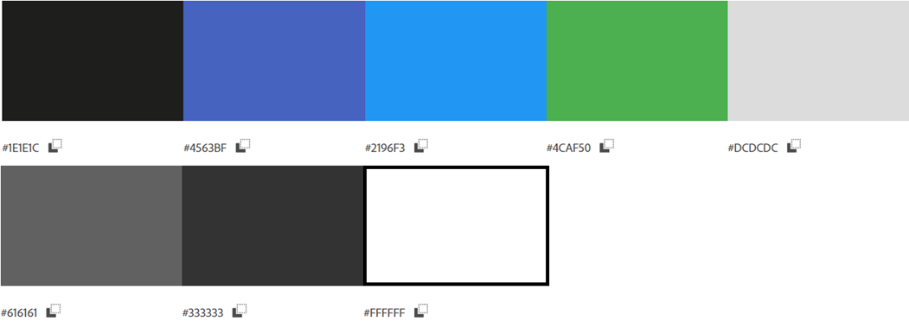
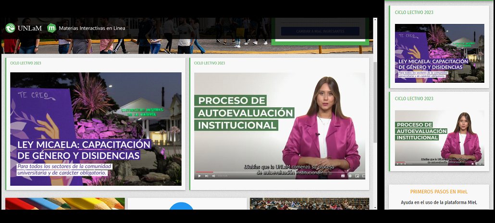
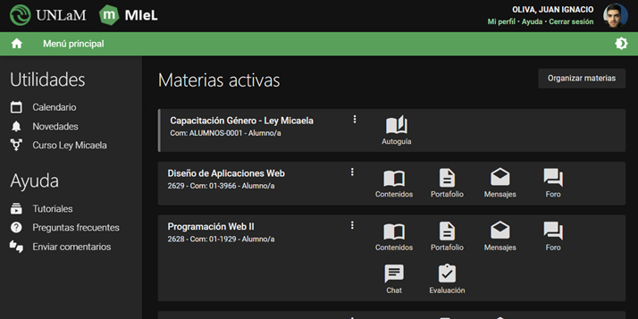
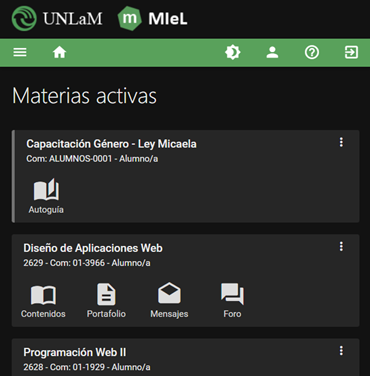
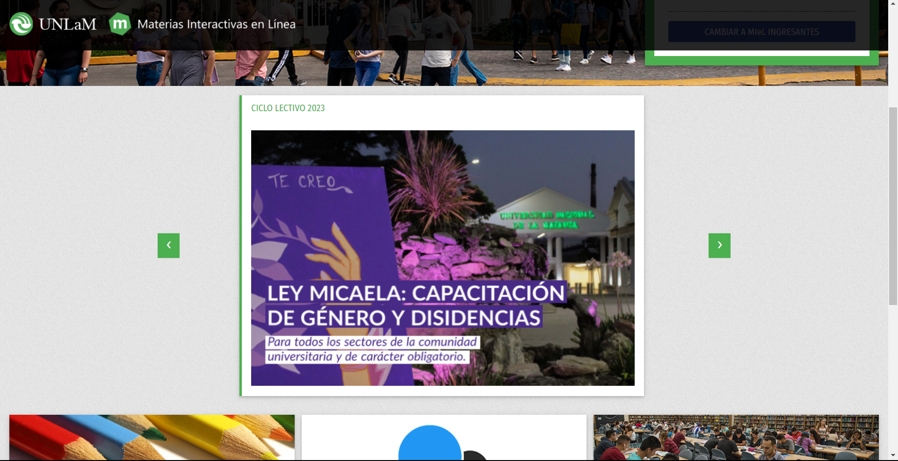
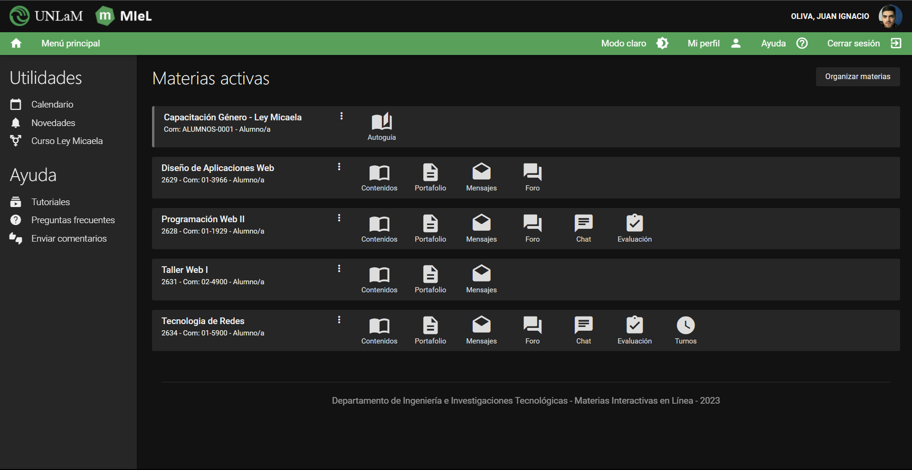

# TRABAJO PRÁCTICO NRO. 1 - Programación web 2

- **Alumno:** Juan Ignacio Oliva
- **Comisión:** 01-1929

### *Ejercicio 1*

---
## Evaluación sobre MIeL:

### Contenido estético
La paleta de colores presenta una escala de grises con letras blancas para generar contraste. Además, se presenta una armonía de análogos con azules y el verde típico de UNLaM para botones y detalles respectivamente. Una vez que se inicia sesión también se utiliza el verde para algunos enlaces y botones.
En cuanto a la distribución de los elementos se puede mencionar que se administran bien los espacios entre ellos.
Hay una gran variedad de iconos, lo cual favorece la usabilidad y ayudan a guiar al usuario.

### Funcionalidad
En este punto se puede mencionar que hay cierta lentitud al iniciar sesión. Pero una vez logueado el sitio funciona realmente rápido.
Parados en el home se puede acceder a todas las secciones de cada materia que se esta cursando, lo cual ayuda al usuario a encontrar rápidamente lo que necesita.

### Tecnología
Al inspeccionar el sitio con F12 podemos notar que se utiliza jquery y clases de w3school para el maquetado.

## Propuestas de mejora:

### Propuesta 1 - Mejora en el home (sin loguear)
En las capturas se visualizan los cards de “CICLO LECTIVO 2023”, que se ubican uno debajo del otro en móvil y uno al lado del otro en escritorio. Se propone llevar estos card a un carrusel, esta mejora brindaría la posibilidad de agregar más de 2 cards en el futuro sin problemas y que el diseño se mantenga consistente tanto en móvil como escritorio.

### Propuesta 2 - Mejora en el home (interno)
Se propone mantener “Mi perfil”, “Ayuda” y “Cerrar sesión” en la barra de navegación en todos los tamaños de pantalla, ya que actualmente solo se encuentran así en la versión móvil. Con esto evitaríamos confundir al usuario a cambiar la ubicación de los elementos. 
Además, se propone ubicar los textos junto con los iconos en tamaño escritorio, para mantener la consistencia en el manejo de la iconografía en el sitio. Es decir, en escritorio tenemos el formato “Icono + texto” y en móvil solo se visualiza el icono.

  

### Resultado propuesta 1

### Resultado propuesta 2

### Instrucciones

- Para visualizar el home interno, hay que hacer click en el boton de "INGRESAR".
- Para volver al home page, clic en "Cerrar sesión".